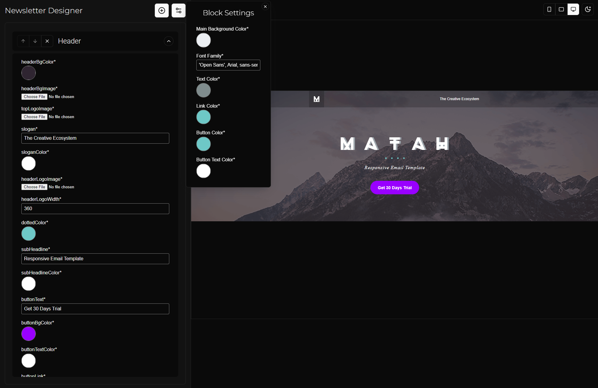

# Newsletter Builder

This is a simple SPA to build an email newsletter from Block-like UI.

## How to run

- Clone the repo
- Run `bun i`
- Run `bun run dev` (or `bun run build` + `bun run preview`)

# Deprecated

## TO DO/IDEAS

- [x] Use a collapsible with an additional up/down arrow to rearraange the blocks
- [x] Fill each block with a default content

## Blocks and what they'll contain

#### Will Contain:

- [x] Schema for each block
- [] Possibly Form UI for each block -- DEPRECATED
- [-] Equivalent HTML template for each block with ability to accept data (which are templatable)
- [x] A metadata like config thing with name, thumbnail image, and possibly a description

#### Functions

- [x] Ability to add new blocks and chose from a list of blocks, (maybe open this in a dialog box or popover)

### Parsing templates

- Fetch an html
- Query select all with attribute data-module [data-module]
  - (All the following steps are now isolated inside each module)
  1. data-bgcolor:
     1. Get all nodes with [data-bgcolor]
     2. Find all unique ones and distribute each in their own separate array (just pointers)
     3. For each unique one, create a new property in schema named after value from their data-bgcolor (and also have ui-widget:color for this type)
     4. Now, in same nodes, add handlebars at [bgcolor] (not [data-bgcolor]) for same prop name.
  2. data-bg: Get all with [data-bg] then same as above
     - Hmm, no size is provided for them in tags, might be worth fetching the provided image and checking its dimensions
     - This does NOT include images used with img-src tag (I couldn't easily swap out such images in Stampready either) they need to be handled separately.
  3. data-size/data-color/data-border-color (or border's individual variant) :
     1. Get all with [data-size]/[data-color]/[data-border-color]
     2. Same as priors
     3. Same as priors
     4. This time, in same nodes, handlebars need to be added inside the inline style attribute's `font-size:{{here}};` or `color:{{here}}`
     - If required, font-family can be managed for each of these bad bois, too (Since most font-fam are bundled in same style tags).
  4. data-link-size/data-link-color:
     1. Get all with with [data-link-size]/[data-link-color]
     2. Same as #3
     3. same as #3
     4. Semi-same as #3, but also need to handlebar styles for a possible descendant <a> tag
  5. <singleline>, <multiline>
     1. Get all by querying the tag.
     2. Replace innerText w/ handlebars whose prop name comes from [label] attribute for this node.
     3. (Obviously change ui schema's widget based on which one it is).
     4. Something to note is all editables' direct parent td tag has a [editable] attribute to it which could also be a candidate for prop name
  6. 
     1. Get all by querying the tag.
     2. Use their width to tell widget how much to ask server to resize for.
     3. Use mc:edit (it's directly img tag's attribute here) for prop name (label is bad in Matah template)
     4. Add handlebars for src
- Global Settings:
  - Might be worth having a way to 'select' blocks in frontend and have their common props (same name and type) be populated to edit in global settings UI.
  - The way Stampready does it is unituitive, and leaves me unsure as to what exactly changes when updating after selecting 'Effect all Modules.' (Coz most of the things don't work as u'd expect)
