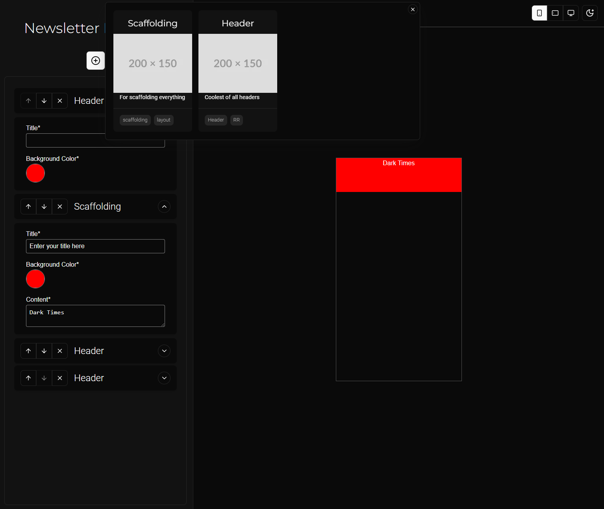

# Newsletter Builder

This is a simple SPA to build an email newsletter from Block-like UI.

## TO DO/IDEAS

- [x] Use a collapsible with an additional up/down arrow to rearraange the blocks
- [x] Fill each block with a default content

## Blocks and what they'll contain

#### Will Contain:

- [x] Schema for each block
- [] Possibly Form UI for each block -- DEPRECATED
- [-] Equivalent HTML template for each block with ability to accept data (which are templatable)
- [x] A metadata like config thing with name, thumbnail image, and possibly a description

#### Functions

- [x] Ability to add new blocks and chose from a list of blocks, (maybe open this in a dialog box or popover)
