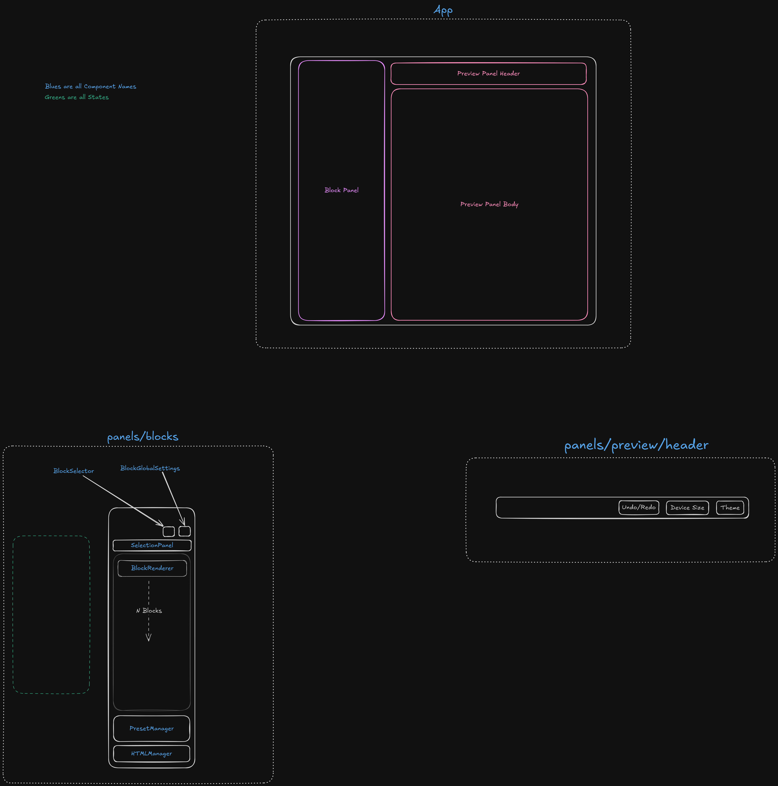

# Newsletter Builder

This is a simple SPA to build an email newsletter from Block-like UI.

## How to run

- Clone the repo
- Run `bun i`
- Extract your templates in `Templates` folder (the folder structure should be like `Templates/xyzTemplate/` and `index.html` should be inside it alongside any images it needs, they'll be relatively used)
  - Suggested template: [Matah Emai](https://themeforest.net/item/matah-responsive-email-set/10569882)
- First run `bun serve` to start mock api (tho it really handles image uploads and resizing)
- Then in a new terminal, run `bun run dev`
- `bun run build` + `bun run preview` doesn't play well with api right now bcoz of relative paths.

## Project Structure

