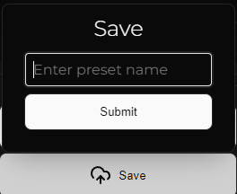
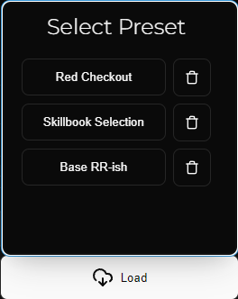

# Email Editor SPA

A feature-rich, embeddable email editor Single Page Application (SPA) designed for creating modular, email-safe designs. This pseudo WYSIWYG editor allows you to build emails using pre-existing template modules, ensuring compatibility across various email clients.


## Key Features

- **Import Email Templates**: Parse and import email templates (especially StampReady templates) as modular, editable components.

<div align="center"></div>

- **Export and Import**: Save your work as JSON, import previously saved designs, and save/load from server.

<div align="center" style="display:flex;justify-content:center;align-items:center; gap:1rem">
   
   
</div>

- **Download Safe HTML**: Generate and download sanitized, email-safe HTML.

- **Responsive Preview**: View your design across multiple device sizes (mobile, tablet, PC).

- **Theme Support**: Light/Dark mode that can sync with the parent application (defaults to 'theme-dark' class on body).

- **CSS Isolation**: Completely isolated CSS to prevent conflicts with parent application styles.

- **Mock Express Server**: Includes a mock server for image upload (with resizing), template serving, and preset management.

- **Server-Side Rendering Support**: Convert module variables into placeholders for server-side data injection.

<div align="center"></div>

- **Bulk Settings**: Change overlapping/merged settings for multiple blocks simultaneously.

<div align="center"></div>

## API and Server Requirements

The application comes with a mock Express server that handles image uploads, template serving, and preset management. For production use, you'll need to implement similar endpoints:

- `/upload`: POST endpoint for image uploads (with optional resizing)
- `/templates`: GET endpoint to serve email templates
- `/preset`: GET, POST, DELETE endpoints for managing presets
- `/presets`: GET endpoint to list all presets

Refer to the `api/routes` directory and `server.ts` for detailed implementation. The `.env.example` file outlines necessary environment variables:

```
VITE_API_URL=https://your-api-url.com
VITE_BASE_PATH=newsletter-builder
VITE_TEMPLATE_ID=Template1,Template2,Template3
```

(These vars are used for build, client querying as well as mock server)

For production, ensure your server can handle image uploads (potentially to a cloud storage bucket or equivalent) and preset storage with your preferred implementation.

## How to run

- Clone the repo
- Run `bun i` (or your preferred package manager's install command)
- Extract your templates in `Templates` folder (the folder structure should be like `Templates/xyzTemplate/` and `index.html` should be inside it alongside any images it needs, they'll be relatively used)
  - Suggested template: [Matah Emai](https://themeforest.net/item/matah-responsive-email-set/10569882)

### Development

- First run `bun serve` to start mock api (tho it really handles image uploads and resizing)
- Then in a new terminal, run `bun run dev`

### Production

- `bun run build` followed by `bun run serve` (or your preferred server).

## Project Structure

The project is a React SPA using Tanstack Query for data fetching, Zustand for state management, Radix components for UI, Handlebars for templating alognside other minor packages.


## Embedding

To embed this SPA in your project, include the compiled JS and CSS files. Ensure your server implements the required API endpoints as described in the API section.
